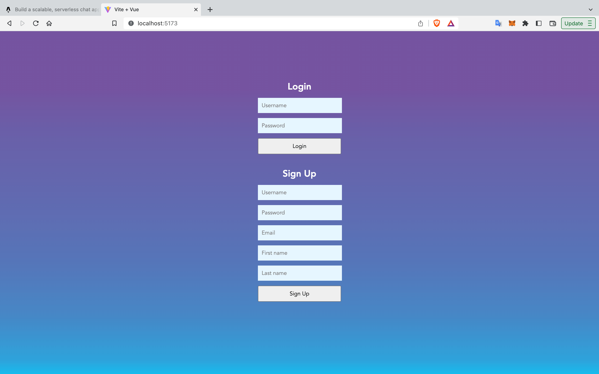
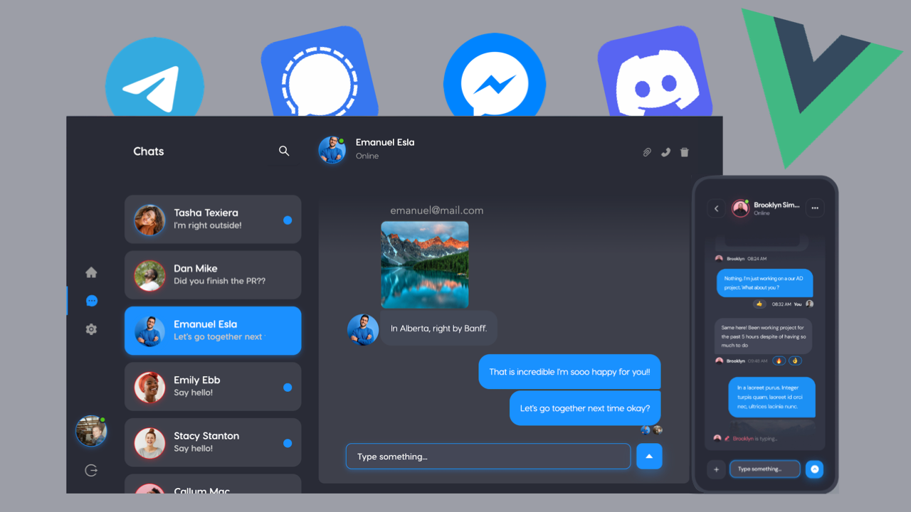

# Vue ChatEngine App
 
Vue ChatEngine App is a scalable, serverless chat application.

## 🚀 Features

- **Realtime Chat**: The app allows users to chat with one another in realtime once they are signed in. 
- **Serverless**: The app utilises ChatEngine.io that handles all the backend for us, as well as allowing seamless integration of chat functionality. 

## 🛠️ Technologies

- `Vue.js`
- `Vite.js`
- `ChatEngine.io`
- `Axios`
- `JavaScript`
- `Veaury`

## 📝 How It Works

Once users have signed up for an account, they can easily start chats with other users that are registered on the app just like any other chat application. 

## 🚦 Running the Project

To run the project in your local environment, follow these steps:

1. Clone the repository to your local machine.
2. Run `npm install` in the project directory to install the required dependencies.
3. Run `npm run dev` to get the project started.
4. Open the address shown in your console in your web browser to view the app.

## 🐞 Issues

- [Mar 2024] Error 400: AxiosError pops up when a user attempts to sign up. 

## 📸 App Showcase

